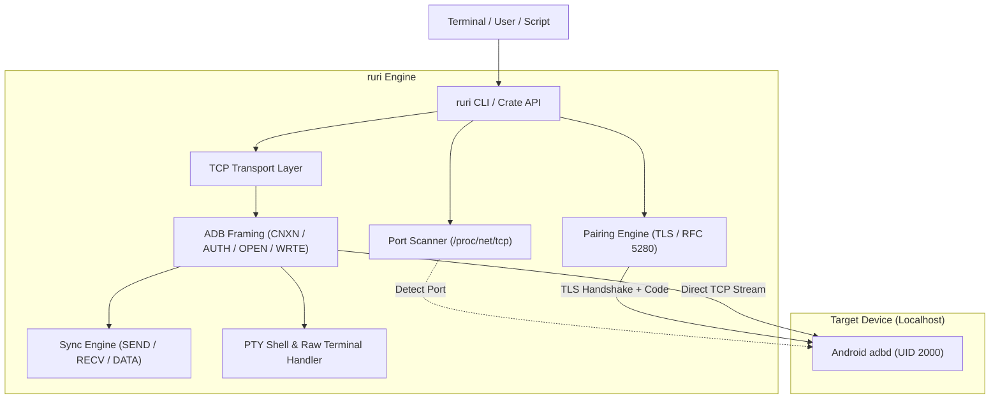

# Ruri

**A Lightweight Pure-Rust Wireless ADB Client and Engine**

[](LICENSE)
[](https://www.rust-lang.org/)
[]()

> [!NOTE]
> `ruri` is an independent, zero-dependency pure-Rust implementation of the Android Debug Bridge (ADB) protocol. It runs natively on-device (e.g. inside Termux on Android) and Linux without requiring Google's official `adb` binary, Android SDK tools, or background server daemons.

---

## Overview

Traditional ADB setups on Android devices require either rooting the device, running a bulky multi-megabyte C/C++ `adb` client bundled with a separate server daemon, or routing through Shizuku's IPC binder service (`rish`).

`ruri` implements the core ADB framing protocol, TLS pairing engine, sync file transfer, and pseudo-terminal (PTY) handling in pure Rust. It connects directly to the local `adbd` wireless debugging socket over `127.0.0.1`, authenticates via RSA / TLS certificates, and grants UID 2000 (`shell`) privileges with near-zero latency and minimal memory overhead.

---

## Architecture



---

## Technical Characteristics

1. **Native Protocol Implementation**: Directly handles ADB packet framing (`A_CNXN`, `A_AUTH`, `A_OPEN`, `A_OKAY`, `A_WRTE`, `A_CLSE`) over raw TCP sockets.
2. **Local Wireless Pairing**: Self-generates X.509 certificates and handles the Android 11+ TLS pairing protocol without third-party toolchains.
3. **Zero-Config Port Scanning**: Automatically identifies the ephemeral wireless debugging port assigned by Android via `/proc/net/tcp6` and `/proc/net/tcp` inspection, with fallback caching in `~/.ruri/last_port`.
4. **Interactive PTY Shell**: Configures host terminal into raw mode (`termios`) with non-blocking asynchronous standard I/O polling, supporting full escape codes, signals, and text editors (`nano`, `vi`).
5. **Direct Stream Transfers**: Implements the ADB `sync:` subprotocol (`SEND`, `RECV`, `DATA`, `DONE`) for file push and pull operations without base64 or temporary disk staging.
6. **Dual Target Distribution**: Compiles to a standalone binary (`ruri`), a Rust library crate (`rlib`), and a C-compatible shared library (`libruri.so`).

---

## CLI Usage

### Initial Setup & Pairing (One-Time)

Enable **Wireless Debugging** in Developer Options, tap **Pair device with pairing code**, and run:

```bash
# Interactive mode (prompts for port and 6-digit code):
ruri pair

# Or provide them directly:
ruri pair <port> <code>
```

Once paired, the key is permanently authorized. Subsequent executions auto-detect the active debugging port.

### Core Commands

```bash
# Open interactive shell (UID 2000)
ruri shell

# Execute a non-interactive command and stream output
ruri exec "pm list packages -3"

# Connect to an explicit port
ruri connect 38451

# Scan localhost for open adbd instance
ruri scan
```

### File Transfer

```bash
# Push a local file to the device
ruri push ./payload.bin /data/local/tmp/payload.bin

# Pull a remote file to the local directory
ruri pull /sdcard/Download/test.log ./test.log
```

### App & System Utilities

```bash
# Direct stream APK installation (pm install -r -d -t)
ruri install app-release.apk

# Capture screenshot directly to image file
ruri screenshot display.png

# Record screen video directly to file
ruri screenrecord screen.mp4

# App process management
ruri launch com.example.app
ruri stop com.example.app
ruri clear com.example.app

# Quick shortcuts
ruri battery
ruri pm list packages -s
```

---

## Programmatic Usage

### Rust Crate

Add `ruri` to your `Cargo.toml`:

```rust
use ruri::RuriClient;

fn main() -> Result<(), Box<dyn std::error::Error>> {
    // Auto-detect port on localhost
    let client = RuriClient::auto_connect()?;

    // Execute command and capture output
    let output = client.exec("id")?;
    println!("Device response: {}", output);

    // Push file
    client.push_file("local.txt", "/data/local/tmp/remote.txt")?;

    Ok(())
}
```

### C-ABI / FFI (`libruri.so`)

`ruri` exports C-compatible symbols for embedding into other languages:

```c
#include <stdint.h>
#include <stdbool.h>

typedef struct {
    char* data;
    uintptr_t len;
    bool success;
} RuriResult;

uint16_t ruri_scan_port(void);
RuriResult ruri_exec_cmd(const char* cmd);
void ruri_free_result(RuriResult res);
```

---

## Building from Source

```bash
# Build optimized release binary
cargo build --release

# The compiled binary and shared library are output to:
# target/release/ruri
# target/release/libruri.so
```

---

## License

Licensed under the Apache License, Version 2.0. See [LICENSE](LICENSE).

---

<div align="center">

Built with 🦀 by [Seuriin](https://github.com/SSL-ACTX) and [Iris-Seravelle](https://github.com/Iris-Seravelle)

</div>
